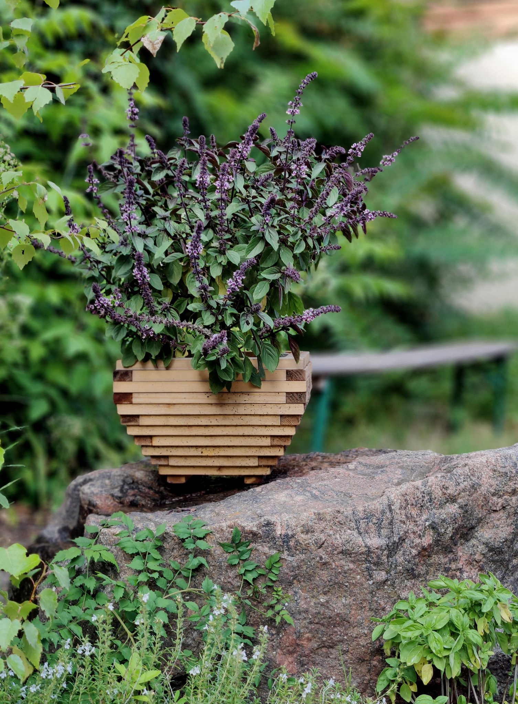

# Hyperwood Trough
This versatile trough demonstrates Hyperwood’s capability to create curved forms from straight slats—perfect as a plant container or decorative piece.




## Usage
```
Usage: hyperwood-trough --width <WIDTH> --depth <DEPTH> --height <HEIGHT> --variant <VARIANT>

Options:
      --width <WIDTH>      The width of the trough
      --depth <DEPTH>      The depth of the trough
      --height <HEIGHT>    The height of the trough. Must be an integer, and greater than 3
      --variant <VARIANT>  Provide the slat variant to use. Specify each three dimension, eg 0.06x0.04x0.06
  -h, --help               Print help
  -V, --version            Print version
```

## Example
```
$ hyperwood-trough --variant 0.06x0.06x0.04 --width 13 --height 12 --depth 8
Hyperwood Exchange Format
Version 1
hyperwood.org
Trough
{"width":13,"depth":8,"height":12}
{"x":0.06,"y":0.06,"z":0.04}
{"width":0.96,"depth":0.48,"height":0.56,"volume":0.22771032}
6
Wall even
Wall side odd
Wall odd
Floor
Wall side even
Skid
0.25881904 0.25881904 0 0 6.482362 0 0 5
11.741181 0.25881904 0 0 6.482362 0 0 5
0 0 1 12 0 0 1 3
0 1 1 12 0 0 1 3
0 2 1 12 0 0 1 3
0 3 1 12 0 0 1 3
0 4 1 12 0 0 1 3
0 5 1 12 0 0 1 3
0 6 1 12 0 0 1 3
0 7 1 12 0 0 1 3
-0.25881904 -0.25881904 2 0 7.517638 0 2 4
12.258819 -0.25881904 2 0 7.517638 0 2 4
0.74118096 -0.25881904 2 10.517638 0 0 2 0
0.74118096 7.258819 2 10.517638 0 0 2 0
-0.5 0.5 3 0 6 0 3 1
12.5 0.5 3 0 6 0 3 1
-0.5 -0.5 3 13 0 0 3 2
-0.5 7.5 3 13 0 0 3 2
-0.70710677 -0.70710677 4 0 8.414213 0 4 4
12.707107 -0.70710677 4 0 8.414213 0 4 4
0.29289323 -0.70710677 4 11.414213 0 0 4 0
0.29289323 7.7071066 4 11.414213 0 0 4 0
-0.86602545 0.13397455 5 0 6.732051 0 5 1
12.866026 0.13397455 5 0 6.732051 0 5 1
-0.86602545 -0.86602545 5 13.732051 0 0 5 2
-0.86602545 7.8660254 5 13.732051 0 0 5 2
-0.9659259 -0.9659259 6 0 8.931851 0 6 4
12.965926 -0.9659259 6 0 8.931851 0 6 4
0.034074128 -0.9659259 6 11.931851 0 0 6 0
0.034074128 7.9659257 6 11.931851 0 0 6 0
-1 0 7 0 7 0 7 1
13 0 7 0 7 0 7 1
-1 -1 7 14 0 0 7 2
-1 8 7 14 0 0 7 2
-0.9659258 -0.9659258 8 0 8.931851 0 8 4
12.965926 -0.9659258 8 0 8.931851 0 8 4
0.034074187 -0.9659258 8 11.931851 0 0 8 0
0.034074187 7.9659257 8 11.931851 0 0 8 0
-0.8660254 0.13397461 9 0 6.732051 0 9 1
12.866025 0.13397461 9 0 6.732051 0 9 1
-0.8660254 -0.8660254 9 13.732051 0 0 9 2
-0.8660254 7.8660254 9 13.732051 0 0 9 2
-0.70710677 -0.70710677 10 0 8.414213 0 10 4
12.707107 -0.70710677 10 0 8.414213 0 10 4
0.29289323 -0.70710677 10 11.414213 0 0 10 0
0.29289323 7.7071066 10 11.414213 0 0 10 0
-0.49999982 0.5000002 11 0 5.9999995 0 11 1
12.5 0.5000002 11 0 5.9999995 0 11 1
-0.49999982 -0.49999982 11 13 0 0 11 2
-0.49999982 7.5 11 13 0 0 11 2
```

© 2025 Johannes J. Schmidt
